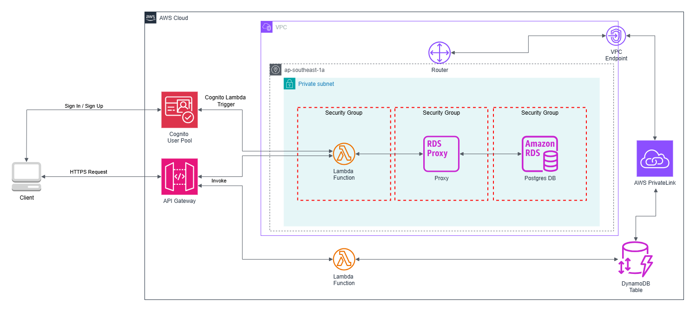

# Microservices Serverless (Node.js)



One of the key challenges in modern software dev is managing the complexity and scalability of large, monolithic applications. As these applications grow, they become harder to maintain, update, and scale. A small change in one part of the system can have unintended consequences elsewhere, leading to increased risk and slower dev cycles. Microservices architecture addresses these issues by breaking down a large application into smaller, independent services, each responsible for a specific functionality. These services communicate through REST APIs, allowing them to be developed, deployed, and scaled independently. This modular approach not only reduces complexity but also enhances fault isolation, as failures in one service don’t cascade to others. By enabling teams to work on different services concurrently and with the freedom to choose the best tools for each job, microservices also accelerate dev and improve overall system resilience and flexibility.

In this project, we’ll build a robust and scalable microservices-based REST API using the Serverless Framework, AWS services, and Node.js. Our goal is to create a flexible architecture that allows for easy deployment, efficient scaling, and seamless integration with other services.

This architecture leverages AWS services to create a scalable, efficient, and secure system.

1. **Cognito User Pool**: AWS Cognito handles user authentication, managing sign-up and sign-in processes. During pre-sign-up, Cognito invokes a Lambda function to perform custom logic.

2. **REST API Gateway**: Acts as the main entry point for client requests, routing them to the appropriate backend services. It provides a secure and scalable interface for the client to interact with the system.

3. **Lambda Functions**: Ideal for building microservices, data processing workflows, and automating operational tasks without the overhead of managing server infrastructure. It is a serverless computing service that lets you run code without provisioning or managing servers.

4. **VPC (Virtual Private Cloud)**: The VPC provides network isolation and security for the architecture. It hosts the Lambda functions, RDS Proxy, and database instances within private subnets.

5. **Security Groups**: These act as virtual firewalls for the Lambda functions, RDS Proxy, and Postgres RDS, controlling inbound and outbound traffic to ensure secure communication between components.

6. **RDS Proxy**: Enhances database connection efficiency by pooling and managing connections to the Postgres RDS. It helps improve scalability and availability of the database.

7. **Postgres RDS**: A managed relational database service that stores user information. It provides features like automated backups, patching, and replication for high availability.

8. **UserAttributes DynamoDB Table**: A NoSQL database that stores user attributes and access information. It offers high performance and scalability for handling large volumes of data.

9. **VPC Endpoint**: Facilitates secure communication between the VPC and other AWS services without traversing the public internet, enhancing security.

### Bastion Host


To access a Postgres DB located in a private subnet (which lacks internet access), a Bastion Host is required. The Bastion Host will be placed in a public subnet, allowing internet connectivity via the Internet Gateway (IGW). It will have a Security Group with an inbound rule that permits only authorized IP addresses, providing instance-level security since it's exposed to the internet. The Postgres DB instance will also be secured by a Security Group with an inbound rule that allows connections from the Bastion Host, ensuring controlled and secure access to the database.

## AWS Well-Architected Framework

1. **Operational Excellence**

- **Automation and Monitoring**: The use of AWS Lambda functions facilitates automation, reducing the operational burden. Monitoring can be implemented through AWS CloudWatch, providing real-time insights and logging for troubleshooting.
- **Infrastructure as Code**: By using services like AWS CloudFormation, the entire infrastructure can be defined and managed as code, allowing for consistent and repeatable deployments.

2. **Security**

- **Authentication and Access Control**: AWS Cognito manages user authentication securely, ensuring that only authenticated users can access the system. Lambda functions operate within a VPC, with security groups providing fine-grained control over network access.
- **Data Protection**: The architecture ensures data protection at multiple layers. Data in transit is secured using HTTPS, and data at rest in RDS and DynamoDB can be encrypted using AWS KMS (Key Management Service).
- **Network Security**: The use of private subnets and VPC endpoints ensures that sensitive data and resources are protected from direct internet exposure, minimizing the attack surface.

3. **Reliability**

- **High Availability**: AWS Lambda functions are inherently highly available, scaling automatically with incoming requests. Amazon RDS and DynamoDB offer built-in high availability and data replication features.
- **Fault Tolerance**: The architecture leverages managed services that provide automatic failover and backups. AWS Lambda's event-driven model ensures that functions are resilient to individual component failures.

4. **Performance Efficiency**

- **Scalability**: The serverless nature of AWS Lambda ensures that compute resources scale automatically based on demand. Amazon RDS Proxy improves the efficiency of database connections, and DynamoDB offers seamless scaling to handle large volumes of data.
- **Event-Driven Architecture**: The use of an event-driven architecture allows for efficient resource utilization, as resources are only consumed when needed. API Gateway and Lambda functions together provide a highly scalable interface for client interactions.

5. **Cost Optimization**

- **Pay-As-You-Go**: AWS Lambda and DynamoDB follow a pay-as-you-go pricing model, allowing for cost-effective scaling based on actual usage. This reduces costs by ensuring that resources are not over-provisioned.
- **Resource Allocation**: The architecture's use of managed services reduces the need for manual intervention and maintenance, leading to lower operational costs. RDS Proxy optimizes database connections, reducing the cost associated with database resources.

**Conclusion**

This architecture demonstrates a well-balanced implementation aligned with the AWS Well-Architected Framework. It leverages AWS services to build a secure, reliable, efficient, and cost-effective solution for managing user data and access. The use of serverless computing, managed services, and robust security measures ensures that the system can scale and perform efficiently while maintaining high availability and security.

## Infrastructure

### Build the Cloud Architecture by Creating the CloudFormation Stacks

**Prerequisites**

- AWS CLI

1. Once inside the project directory, navigate to "CloudFormation" directory.

```bash
$ cd CloudFormation
```

2. Then execute the cloudformation command to create stack

```bash
$ aws cloudformation create-stack --stack-name [PROJECT_NAME]-[Stage]-[TEMPLATE_NAME] --template-body file://templates/[TEMPLATE_NAME].yaml --parameters ParameterKey=ProjectName,ParameterValue=[PROJECT_NAME] ParameterKey=Stage,ParameterValue=[Stage] --profile [aws_profile]
```

**_Note: Add `--capabilities CAPABILITY_NAMED_IAM` flag for `serverlessapp.yaml` template._**

### Database Migration

**Prerequisites**

- NodeJS
- Postgres

1. Once inside the project directory, navigate to "Database" directory.

```bash
$ cd Database
```

2. Create migration script by executing this command:

```bash
$ npx db-migrate create [migration_name] --config .\config\database.json -e [database_environment]
```

3. Run the migration script:

```bash
$ npx db-migrate up [migration_script_filename] --config .\config\database.json -e [database_environment]
```

```bash
$ npx db-migrate down [migration_script_filename] --config .\config\database.json -e [database_environment]
```

### Microservices

**Prerequisites**

- AWS CLI
- Node.js (v20)
- Docker

**DotENV**

```bash
# For AWS deployment using Docker
AWS_ACCESS_KEY_ID=
AWS_SECRET_ACCESS_KEY=
AWS_DEFAULT_REGION=

# Required environment variables for microservices Rest API serverless
PROJECT_NAME=
STAGE=dev

# Unbuffer the entire service
PYTHONUNBUFFERED=1
```

**Deployment:**

1. From root directory `MicroserviceUsingServerlessFramework`, navigate to `.docker` of `infrastructure` folder.

```bash
$ cd .\microservices\.docker
```

2. Run the docker compose command and specify the name of the service to deploy

```bash
$ docker compose up [service_name]
```

**_Note: Make sure you are using `command: sh -c "echo \"Build and deploy Coffee service\" && cd /myservice/layer/nodejs && npm i && cd /myservice && npm i && npx sls deploy -s dev"` inside the `docker-compose.yml` file._**

**Adding common dependencies:**

When you want to add dependencies for a specified service, you must install those dependencies in the `package.json` file located in both the root directory and the `layer/nodejs` directory of the service. The `package.json` file in layer/nodejs is for common dependencies for all the service’s AWS Lambdas in the cloud, while the `package.json` file in the root directory of the service is for offline use.

```bash
$ npm install [dependency_name]
```

In the future, if you have too many services, you may also add common dependencies for all microservices and automate the installation of these common dependencies. This approach makes it easier and faster for developers to install dependencies and prevents problematic missing dependencies after deployment.

**_Note: `@aws-sdk` package is optional in Lambda layer's `package.json` because AWS provides it already in their Lambda environment._**

### Serverless Offline for Local Environment

**Prerequisites**

- Python

**Installation:**

1. Navigate to `microservices/offline` directory then execute this command:

```bash
$ pip install -r requirements.txt
```

2. After executing the command, install all dependencies that are defined on `package.json` by executing this command:

```
$ npm install
```

**Usage:**

```bash
$ npm run offline
```
