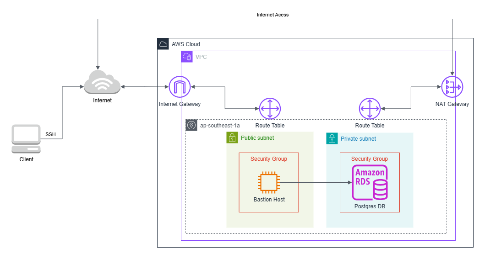

# Microservices Serverless (Node.js)

One of the key challenges in modern software dev is managing the complexity and scalability of large, monolithic applications. As these applications grow, they become harder to maintain, update, and scale. A small change in one part of the system can have unintended consequences elsewhere, leading to increased risk and slower dev cycles. Microservices architecture addresses these issues by breaking down a large application into smaller, independent services, each responsible for a specific functionality. These services communicate through REST APIs, allowing them to be developed, deployed, and scaled independently. This modular approach not only reduces complexity but also enhances fault isolation, as failures in one service don’t cascade to others. By enabling teams to work on different services concurrently and with the freedom to choose the best tools for each job, microservices also accelerate dev and improve overall system resilience and flexibility.

In this project, we’ll build a robust and scalable microservices-based REST API using the Serverless Framework, AWS services, and Node.js. Our goal is to create a flexible architecture that allows for easy deployment, efficient scaling, and seamless integration with other services.


### Key Components:

1. Serverless Framework: We’ll leverage the Serverless Framework to define our infrastructure as code (IaC). This framework simplifies the process of deploying serverless microservices by managing AWS resources, such as Lambda functions.

2. Microservices Architecture: Our API will be broken down into smaller, independent microservices. Each microservice will handle a specific functionality, promoting modularity and maintainability.

3. Node.js: We’ll use Node.js for our backend logic. Node.js is well-suited for serverless applications due to its asynchronous nature and lightweight footprint.

4. RESTful API Design: We’ll design our API endpoints following RESTful principles. This ensures clear communication between clients and services, making it easier to consume and maintain.

5. AWS Services:

   - AWS Lambda: Our microservices will run as Lambda functions, allowing us to execute code without managing servers.

   - Amazon API Gateway: We’ll create RESTful endpoints using API Gateway, enabling secure access to our services.

   - Amazon DynamoDB: For data storage, we’ll use DynamoDB, a fully managed NoSQL database.

   - AWS IAM: We’ll configure fine-grained permissions using Identity and Access Management (IAM) roles.

   - AWS CloudFormation: We’ll use CloudFormation to model and provision our AWS resources, such as VPCs, policies, DynamoDB tables, and REST API Gateways. It is also used by the Serverless Framework under the hood to provision our Lambda functions and other AWS resources.

   - Amazon RDS (Relational Database Service): Managed database service that makes it easier to set up, operate, and scale relational databases in the cloud. It handles routine database tasks like provisioning, patching, backup, recovery, failure detection, and repair.

   - RDS Proxy: Fully managed database proxy feature for Amazon RDS that makes applications more scalable, resilient, and secure. Here are its key benefits:

     1. Connection Pooling and Management

     2. Enhanced Security

     3. Improved Availability

### Bastion Host Setup



## Infrastructure

### Build the Cloud Architecture by Creating the CloudFormation Stacks

**Prerequisites**

- AWS CLI

1. Once inside the project directory, navigate to "CloudFormation" directory.

```bash
$ cd CloudFormation
```

2. Then execute the cloudformation command to create stack

```bash
$ aws cloudformation create-stack --stack-name [PROJECT_NAME]-[Stage]-[TEMPLATE_NAME] --template-body file://templates/[TEMPLATE_NAME].yaml --parameters ParameterKey=ProjectName,ParameterValue=[PROJECT_NAME] ParameterKey=Stage,ParameterValue=[Stage] --profile [aws_profile]
```

**_Note: Add `--capabilities CAPABILITY_NAMED_IAM` flag for `serverlessapp.yaml` template._**

### Database Migration

**Prerequisites**

- NodeJS
- Postgres

1. Once inside the project directory, navigate to "Database" directory.

```bash
$ cd Database
```

2. Create migration script by executing this command:

```bash
$ npx db-migrate create [migration_name] --config .\config\database.json -e [database_environment]
```

3. Run the migration script:

```bash
$ npx db-migrate up [migration_script_filename] --config .\config\database.json -e [database_environment]
```

```bash
$ npx db-migrate down [migration_script_filename] --config .\config\database.json -e [database_environment]
```

### Microservices

**Prerequisites**

- AWS CLI
- Node.js (v20)
- Docker

**DotENV**

```bash
# For AWS deployment using Docker
AWS_ACCESS_KEY_ID=
AWS_SECRET_ACCESS_KEY=
AWS_DEFAULT_REGION=

# Required environment variables for microservices Rest API serverless
PROJECT_NAME=
STAGE=dev

# Unbuffer the entire service
PYTHONUNBUFFERED=1
```

**Deployment:**

1. From root directory `MicroserviceUsingServerlessFramework`, navigate to `.docker` of `infrastructure` folder.

```bash
$ cd .\microservices\.docker
```

2. Run the docker compose command and specify the name of the service to deploy

```bash
$ docker compose up [service_name]
```

**_Note: Make sure you are using `command: sh -c "echo \"Build and deploy Coffee service\" && cd /myservice/layer/nodejs && npm i && cd /myservice && npm i && npx sls deploy -s dev"` inside the `docker-compose.yml` file._**

**Adding common dependencies:**

When you want to add dependencies for a specified service, you must install those dependencies in the `package.json` file located in both the root directory and the `layer/nodejs` directory of the service. The `package.json` file in layer/nodejs is for common dependencies for all the service’s AWS Lambdas in the cloud, while the `package.json` file in the root directory of the service is for offline use.

```bash
$ npm install [dependency_name]
```

In the future, if you have too many services, you may also add common dependencies for all microservices and automate the installation of these common dependencies. This approach makes it easier and faster for developers to install dependencies and prevents problematic missing dependencies after deployment.

**_Note: `@aws-sdk` package is optional in Lambda layer's `package.json` because AWS provides it already in their Lambda environment._**

### Serverless Offline for Local Environment

**Prerequisites**

- Python

**Installation:**

1. Navigate to `microservices/offline` directory then execute this command:

```bash
$ pip install -r requirements.txt
```

2. After executing the command, install all dependencies that are defined on `package.json` by executing this command:

```
$ npm install
```

**Usage:**

```bash
$ npm run offline
```
