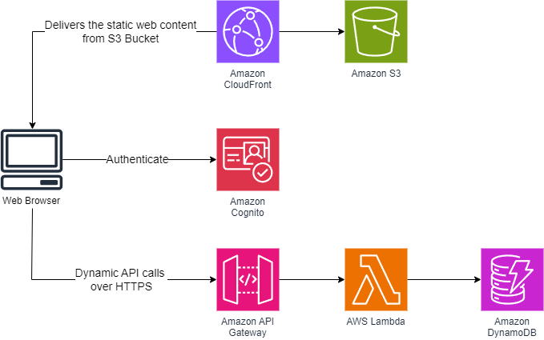

# Wildrydes End-to-End Serverless Web Application

## Overview

This serverless web application allows users to request rides on unicorns from the Wild Rydes fleet. The app features an intuitive HTML-based user interface where users can specify their pickup location. On the backend, it interacts with a RESTful web service to submit ride requests and dispatch the nearest available unicorn. Additionally, the application provides user registration and login functionalities, ensuring that only registered users can request rides.

The application’s architecture leverages various AWS resources, including AWS Lambda, Amazon API Gateway, Amazon CloudFront, Amazon S3, Amazon DynamoDB, and Amazon Cognito. Amazon CloudFront delivers static web content stored in Amazon S3 bucket and caches it at AWS edge locations to ensure low-latency distribution to end users. Amazon Cognito handles authentication and user management, securing the API. Amazon API Gateway exposes the Lambda function as a RESTful API. AWS Lambda functions process API calls sent from the web client. For data storage, the application uses Amazon DynamoDB, a NoSQL database, to store unicorn ride request data sent from the client.



## Deploy the application using SAM

The [AWS SAM CLI](https://aws.amazon.com/serverless/sam/) provides functionality for building and testing serverless applications. It makes it easy to sync your changes to your deployment in AWS for rapid development.

To use the [AWS SAM CLI](https://aws.amazon.com/serverless/sam/), you need the following:

- An AWS Account - Create an account at https://aws.amazon.com
- AWS SAM CLI - [Install the AWS SAM CLI](https://docs.aws.amazon.com/serverless-application-model/latest/developerguide/serverless-sam-cli-install.html).
- Node.js - [Install Node.js](https://nodejs.org/en/), including the npm package management tool.

To build and deploy your application, run the following in your shell:

```bash
$ sam build
$ sam deploy --guided --config-env [stage] --profile [aws_profile] --region [aws_region]
```

## Cleanup

You can run the following command to cleanup (delete) all the resources created for this application in your AWS Account:

```bash
$ sam delete --config-env [stage] --profile [aws_profile] --region [aws_region]
```

## Upload static web contents to S3 bucket

You can run the following command to upload the WildRydes website files on S3 bucket

```bash
$ aws s3 cp wildrydes-static-website s3://[website_bucket_name] --recursive --profile [aws_profile] --region [aws_region]
```

**_This is optional if you want to manually build and deploy the wildrydes-app to an S3 bucket instead of using the GitHub workflow._**
